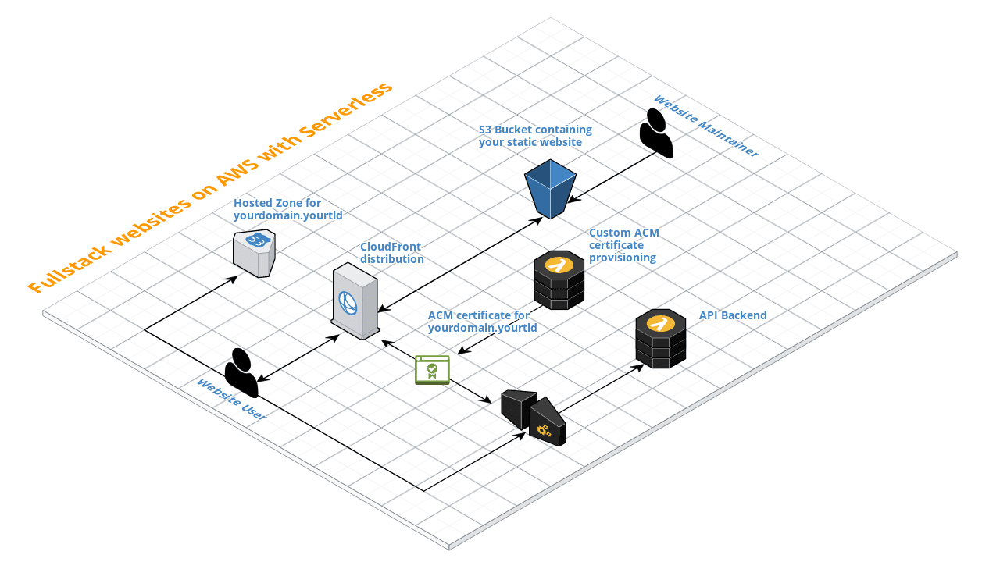

# aws-fullstack-website
Deploy your fullstack websites without all the hassle on AWS with CloudFront, S3, ACM, Route53, API Gateway and Lambda via Serverless.

All set up via one [Serverless](https://www.serverless.com) command and minimum manual configuration!

## Architecture



### What is provisioned in your AWS account?
* A S3 bucket containing your static website
* A CloudFront distribution for global hosting of your static website via CDN
* An API Gateway endpoint for the API backend Lambda function
* A Lambda function for the API backend
* A HostedZone on Route53 with A records for your domain name
* A Lambda function for automatic SSL certificate generation via ACM for your domain name (run once upon deployment)
* DNS records for your custom domain (with `www.` and `api.` subdomains)

All of the CloudFormation resources reside in the `resources` subfolder.

## Preconditions
This guide assumes that you have a pre-existing domain which you want to use for hosting your static website. Furthermore, you need to have access to the domain's DNS configuration.

Also, you need to have an install of [Serverless](https://www.serverless.com) on your machine.

## How-to
To use this blueprint with your own static websites, you can follow the steps below to get started.

### Set up a Serverless project for your static website
There are basically two ways to get started, either use [Serverless](https://www.serverless.com) to generate a basic project structure, or use the "traditional" fork and clone mechanisms.

#### Use Serverless templates
The following command will create a local project structure you can use to deploy your static website in the `myfullstackwebsite` folder relative to your current working directory:

```bash
$ sls create --template-url https://github.com/tobilg/aws-fullstack-website --path myfullstackwebsite
Serverless: Generating boilerplate...
Serverless: Downloading and installing "aws-fullstack-website"...
Serverless: Successfully installed "aws-fullstack-website"
```

**Hint**  
When using this method, Serverless is replacing the `service.name` in the `serverless.yml` file automatically with `myfullstackwebsite`. If you want to use a different stack name, you have to replace it manually. You also need to take care of that the stack name is using only allowed characters. When using the "Fork and clone" method below, the stack name is automatically derived from the domain name and sanitized regarding the allowed characters.

#### Fork and clone
Once you forked the repo on GitHub, you can clone it locally via

```bash
$ git clone git@github.com:youraccount/yourrepo.git
```

where `youraccount/yourrepo` needs to be replaced with the actual repository name of your forked repo.

### Install dependencies
To install the dependencies, do a 

```bash
$ npm i
```

After that, the project is usable.

### Create your static website
You can now create your static website in the `website` folder of your cloned repo.

### Create your API backend
The API backend files can be found in the `api` subfolder. There are some default files which yoou can leave unchanged, the actual API lives in the `api/routes/v1/api.js` file.

It uses the [Lambda API package](https://www.npmjs.com/package/lambda-api), which provides an intuitive way to write API routes and has a lot of built-in functionalities. If you're familiar with writing APIs with [Express](https://www.npmjs.com/package/express), you should be able to come up to speed quite quickly.

#### Base routes
The following routes do pre-exist:

```text
GET /favicon.ico    Returns the static favicon.ico from the 'api/static' folder
GET /v1/info        Returns the API version information 
                    (derived from the 'package.json' file)
GET /v1/api-docs    Returns the OpenAPI v3 documentation of the API
```

#### API docs
Just point [editor.swagger.io](https://editor.swagger.io/) with `File -> Import URL` to `https://api.yourdomain.yourtld/v1/api-docs` where `yourdomain.yourtld` is the domain name you specified as `--domain` argument while deploying. Once you finished editing, just copy and paste the Swagger Editor contents to the `api/static/api-docs.yml` file. After a new deployment, your API docs will be updated.

### Additional AWS resources
If you want to add additional AWS resources, such as a DynamoDB table, you can do this by creating a new file in the `resources` folder, and then use it in the `serverless.yml` file's `resources` section like this:

```yaml
resources:
  - ${file(resources/my-new-resource.yml)}
```

#### Example
An example on how to add a DynamoDB table might look like this: Create a new file `resources/dynamodb-table.yml` with the following content:

```yaml
Resources: 
  BaseDataTable: 
    Type: AWS::DynamoDB::Table
    Properties: 
      TableName: 'my-table'
      KeySchema: 
        - 
          AttributeName: 'partitionKey'
          KeyType: 'HASH'
        - 
          AttributeName: 'sortKey'
          KeyType: 'RANGE'
      AttributeDefinitions: 
        - 
          AttributeName: 'partitionKey'
          AttributeType: 'S'
        - 
          AttributeName: 'sortKey'
          AttributeType: 'S'
      BillingMode: PAY_PER_REQUEST
```

Then, add the following line to the `resources` section of the `serverless.yml` file:

```yaml
resources:
  # other resources
  - ${file(resources/dynamodb-table.yml)}
  # other resources
```

After that, you can (re-)deploy your fullstack wesite (see below).

### Deploy
You can deploy your static website with the following command:

```bash
$ sls deploy --domain yourdomain.yourtld
```

where `yourdomain.yourtld` needs to be replaced with your actual domain name. You can also specify a AWS region via the `--region` flag, otherwise `us-east-1` will be used.

#### Manual update of DNS records on first deploy
On the first deploy, it is necessary to update the DNS setting for the domain manually, otherwise the hosted zone will not be able to be established.

Therefore, once you triggered the `sls deploy` command, you need to log into the AWS console, go to the [Hosted Zones](https://console.aws.amazon.com/route53/home?region=us-east-1#hosted-zones:) menu and select the corresponding domain name you used for the deployment.

The nameservers you have to configure your domain DNS to can be found under the `NS` record and will look similar to this:

```bash
ns-1807.awsdns-33.co.uk.
ns-977.awsdns-58.net.
ns-1351.awsdns-40.org.
ns-32.awsdns-04.com.
```

You should then update your DNS settings for your domain with those values, **otherwise the stack creation process will fail**.

This is a bit misfortunate, but to the best of knowledge there's currently no other way possible if you use AWS external (non-Route53) domains. During my tests with [namecheap.com](https://www.namecheap.com) domains the DNS records were always updated fast enough, so that the stack creation didn't fail.

#### Deployment process duration
As a new CloudFront distribution is created (which is pretty slow), it can take **up to 45min** for the initial deploy to finish. This is normal and expected behavior.

### Post-deploy
If the deployment finished successfully, you will be able to access your domain via `https://www.yourdomain.yourtld` and `https://yourdomain.yourtld`.

### Updates
For every update of your website, you can trigger a deploy as stated above. This will effectively just do s S3 sync of the `website` folder. 

To do a manual sync, your can also use `sls s3sync`. There's also the possibility to customize the caching behavior for individual files or file types via the `serverless.yml`, see the [s3sync plugin's documentation](https://www.npmjs.com/package/serverless-s3-sync#setup).

As **CloudFront caches the contents of the website**, a [Serverless plugin](https://github.com/aghadiry/serverless-cloudfront-invalidate) is used to invalidate files. This [may incur costs](https://docs.aws.amazon.com/AmazonCloudFront/latest/DeveloperGuide/Invalidation.html#PayingForInvalidation), see the [docs](https://aws.amazon.com/de/premiumsupport/knowledge-center/cloudfront-serving-outdated-content-s3/) for more info. 

You can run `sls cloudfrontInvalidate` to do a standalone invalidation of the defined files in the `serverless.yml`.

## Removal
If you want to remove the created stack, your will have to delete all records of the Hosted Zone of the respective domain except the `SOA` and `NS` records, otherwise the stack deletion via

```bash
$ sls remove --domain yourdomain.yourtld
```

will fail.